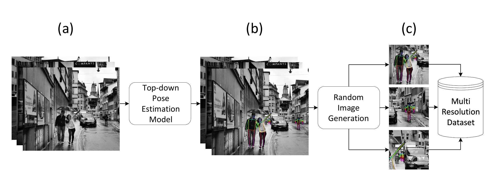

# News

[1/18/2022] This repository is still getting updated.

# ADG-Pose
ADG-Pose is a method of Automated Dataset Generation for real-world human pose estimation. ADG-Pose enables users to determine the *person scale*, *crowdedness*, and *occlusion density* distributions of the generated datasets, allowing for training environments that better match the distributions of the target application.



The above figure shows the three main stages of ADG-Pose. First, a high accuracy top-down human pose estimation model is used to label ultra-high resolution images. Second, we take the fully annotated ultra-high resolution images and generate semi-random crops from them. First, the user can determine the resolution range to take crops at. Second, the user can determine the maximum, minimum, and mean number of persons in a crop. Third, the user can specify the desired average IoU between people in the crop. After these crops are made and the statistics verified, the resulting images and annotations are synthesized into a new multi-resolution dataset. Additional user-defined parameters include the total size of the dataset, "train/val/test splits", image aspect ratio, and skeleton/validation style, which must be compatible with the top-down model used for annotation.


# Environment Setup

We have used Ubuntu 18.04.5, Python 3.6.9, and NVIDIA GPUs for developing the ADG-Pose. The rest of the requirments is listed in Requirements.txt.

# Usage

When making a new output dataset, set up the folder structure beforehand:
```
- generated_dataset
|  - images
|  |  - train
|  |  - val
|  - annotations
```

A sample folder with this structrue is provided under the name generated_dataset.

1. Open the "Decode.py" File and edit the line 260. Look for the comment and change accordingly. The path to the initial dataset must be determined here.
2. Prepare the json file of bounding boxes.
3. Use the appropriate path to a top-down model for extracting keypoints based on prepared bounding boxes.
4. Run Decode.py to automatically annotate the initial dataset. use --json argument to specify location of bounding box json file. Use --cfg to determine path to top-down model configuration file. The final code should look like this:

```
python Decode.py --json path_to_bbox/bbox.json --cfg path_to_top_down_model/config.yaml
```

5. In the "Crop.py" file, Line 32 refers to the "maximum width" the user wants to see in the final generated dataset. It must be edited according to user needs:
```
ADG-Pose/Crop.py/Line:32

CROP_MAX_WIDTH = THE_DESIRED_NUMBER_IN_PIXELS
#for example it can be 1080
```
6. In the "Crop.py" file, Line 33 refers to the "minimum width" the user wants to see in the final generated dataset. It must be edited according to user needs:
```
ADG-Pose/Crop.py/Line:33

CROP_MIN_WIDTH = THE_DESIRED_NUMBER_IN_PIXELS
#for example it can be 512
```

7. In the "Crop.py" file, Line 34 refers to the aspect ratio of the final image that is created using ADG-Pose. It should be edited according to user needs:
```
ADG-Pose/Crop.py/Line:34

CROP_ASPECT = THE_DESIRED_NUMBER
# it should be between 0 and 1, for example it can be 0.75
```
8. In the "Crop.py" file, Line 35 refers to the maximum number of people you want to see in an image. It must be changed base on the user needs:
```
ADG-Pose/Crop.py/Line:35

MAX_PEOPLE = THE_DESIRED_NUMBER
#for example it can be 30
```

9. In the "Crop.py" file, Line 36 and 37 are for configuring the number of empty images. For exmaple changing the code to the following means that 19 out of 20 images are going to have people in them, and 1 of them is going to be random, which in this case, since RETRY_EMPTY_CHANCE is very low, it is most likely to be empty.
```
ADG-Pose/Crop.py/Lines:36 and 37

OCCUPIED_RANDOM_CROP_VAL = 20
RETRY_EMPTY_CHANCE = 0.00001
```

10. Run Crop.py to create a cropped dataset from the annotations and high resolution images. Please make sure that you have opened the code and made changes according to commenting in the file, and the previouse instructions. For running the "Crop.py" use the following command:
```
python Crop.py
```
In the Crop.py file, lines 32 to 35 must be edited according to user needs.


# Citation

Will be announced.
